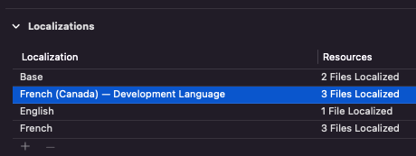

# spread-i18n-core 

**spread-i18n-core** is a library. The library provides a simple interface for:
- import of translations from an Excel file to a project,
- export of translations from a project to an Excel file.

The library is written in `kotlin` language and can be run in `jvm` environments.

## Features

* Supports Android and iOS projects,
* Can be used in `jvm` supporting OSes such as: `Linux`, `macOS`, `Windows` and others,
* Built on top of [Apache POI - the Java API for Microsoft Documents](https://poi.apache.org/),
* Customisable string transformation,
* Supports iOS `InfoPlist.strings`,
* Supports Android `string-array`,
* Simple API.

## Caveats

- Android [xliff notation](https://developer.android.com/guide/topics/resources/localization?hl=en#mark-message-parts) is not supported,

- Android [quantity strings (plurals)](https://developer.android.com/guide/topics/resources/string-resource#Plurals) are not supported.


## API
```kotlin
//kotlin
try {
    //A path can be absolute or relative
    Project.onPath("/path/of/project").import(from = "/path/of/excel/file")
    Project.onPath("/path/of/project").export(to = "/path/of/excel/file")
} catch (exc: TransferException) {
    //...
}
```

```java
//java
try {
    //A path can be absolute or relative
    Project.onPath("/path/of/project").exportTo("/path/of/excel/file", null);
    Project.onPath("/path/of/project").importFrom("/path/of/excel/file", null);
} catch (TransferException exc) {
    //...
}
```

## String transformation

It is possible to transform the strings during the import or export process. For example, imagine you have a common spreadsheet file for Android and iOS projects. One of the strings is dynamic `"hello %s"`, which is formatted at runtime.

The string `"hello %s"` is valid for `java` or `kotlin`: 
```java
String.format("Hello %s", "Robert"); //<<--ok
```

but not for `swift`
```swift
String(format: "Hello %s", "Robert"); //<<--wrong
String(format: "Hello %@", "Robert"); //<<--ok
```
, which expects `%@` not `%s`.

To avoid duplicating Excel files with different translations per platform you can use *String transformation*.


```console
//Single file for Android and iOS
┌───────────────────┐
│key       │default │
├───────────────────┤
│hello_msg │Hello %s│
└───────────────────┘
```

To use the above spreadsheet in an iOS project, apply the string transformation as shown below:

```java
try {
    Map<String, String> transformations  = new HashMap() {{
        put("%s", "%@"); //replace occurrences of %s with %@
    }};
    Project.onPath("/iOS/project/path").importFrom("/excel/file/path", transformations);
} catch (TransferException exc) {
    //...
}
```

Imported string in a `Localizable.strings`:
```
"hello_msg" = "Hello %@";
```

## Spreadsheet format requirements

It is expected to provide an Excel sheet in the expected format. The list below summarizes all format requirements:

- Translations are located in the first sheet (tab)
- The sheet contains a *Header Row*

### Header Row

The *Header Row* describes content of translations stored in a file. Valid *Header Row* contains at least one *Key Cell* and one *Locale Cell*. The library searches for key words to identify the *Header Row*. Capitalization does not matter for searching.

```console
┌─────────────────────────────────────┐
│Key              │default │pl        │ <<-- Header Row
├─────────────────────────────────────┤
│btn_cancel_text  │Cancel  │Anuluj    │
├─────────────────────────────────────┤
│btn_apply_text   │Apply   │Zastosuj  │
└─────────────────────────────────────┘
```

**Key Cell**

The purpose of the *Key Cell* or cells is to point column containing string keys. 
```xml
<!-- message_hello key in Android-->
<string name="message_hello">Bonjour</string>
```

```yaml
//message_hello key in iOS
"message_hello" = "Bonjour";
```

The key cell is identified by one of text: *Key*, *Identifier*, *Id*, *Android*, *iOS*. 

The library supports different keys for Android and iOS kept in the same sheet. To differentiate between Android and iOS keys, there must be two key cells containing "Android" and "iOS" text.

```console
┌───────────────────────────────────────────────────────┐
│iOS             │Android           │default │pl        │
├───────────────────────────────────────────────────────┤
│btn_cancel_text │cancel_button_text│Cancel  │Anuluj    │
├───────────────────────────────────────────────────────┤
│btn_apply_text  │apply_button_text │Apply   │Zastosuj  │
└───────────────────────────────────────────────────────┘
```

**Locale Cell**

The *Locale Cell* contains a language tag which represents one of localization supported by a project. For example, the  *Locale Cell* with language tag `nl` matches: `values-nl` for an Android project and `nl.lproj` for an iOS project. 

There is a special language tag called **default**. 


For Android the **default** tag matches the `strings.xml` file in the `values` directory. 
```console
/src/main/res/
├── drawable
├── ...
├── values
│   ├── colors.xml
│   └── strings.xml  <<--default
├── values-nl
│   └── strings.xml
└── values-fr-CA
...
```

For iOS the **default** tag matches `Development Language` localization.



```console
/project
├── en.lproj
│   └── Localizable.strings
├── fr-CA.lproj
│   └── Localizable.strings <<--default
├── fr.lproj
│   └── Localizable.strings
```

> The **default** tag is mandatory and has to be present in the *Header Row*.

> Android 7.0 (API level 24) introduced support for [BCP 47 language tags](https://www.rfc-editor.org/info/bcp47), which you can use to qualify language- and region-specific resources. **BCP 47 language tags are not supported by the library**. Examples of *BCP 47 language tags*: 
- b+en
- b+en+US
- b+es+419
- b+zh+Hant
- b+sr+Latn+RS

**Comments**

It is possible to use comments. A comment starts with `//` and is placed in the key column. For example, given spreadsheet content:

```console
┌───────────────────────────────────┐
│key            │default │pl        │
├───────────────────────────────────┤
│//Buttons      │        │          │
├───────────────────────────────────┤
│btn_apply_text │Apply   │Zastosuj  │
└───────────────────────────────────┘
```

is imported as:
```xml
<!-- Buttons -->
<string name="btn_apply_text">Apply</string>
```
for Android, and
```yaml
//Buttons
"btn_apply_text" = "Apply";
```
for iOS.

**Android Transltables**

Android localization supports special attribute called `translatable`. If the value of the attribute is `false`, it means that a string is the same for all languages. The library also supports this feature. A key which indicates *non translatable* starts with the `*` prefix. 
For example, given spreadsheet content:

```console
┌────────────────────────────────────┐
│Key                │default │pl     │
├────────────────────────────────────┤
│*celsius_symbol    │°C      │       │
├────────────────────────────────────┤
│*fahrenheit_symbol │°F      │       │
└────────────────────────────────────┘
```

is imported as:
```xml
...
<string name="celsius_symbol" translatable="false">°C</string>
<string name="fahrenheit_symbol" translatable="false">°F</string>
...
```

**Android String Arrays**

The library supports *Android string arrays*. A key which indicates *String Arrays* ends with the `-array` suffix. For example, given spreadsheet content:
```console
┌──────────────────────────┐
│Key            │default   │
├──────────────────────────┤
│weekdays-array │Monday    │<<-- Each item is separated by a new line
│               │Tuesday   │
│               │Wednesday │
├──────────────────────────┤
│hello          │Hello     │
└──────────────────────────┘
```

is imported as:
```xml
...
<string-array name="weekdays">
    <item>Monday</item>
    <item>Tuesday</item>
    <item>Wednesday</item>
</string-array>
<string name="hello">Hello</string>
...
```

## Project requrements

Destination translation files have to exist. The library does not create files. It overwrites content.

## Project type identification

To import or export translations, the library only requires the project and spreadsheet paths. You don't need to pass a project type. The library itself is able to determine the type of the project.

The library searches for specific files. If the library finds the `AndroidManifest.xml` file, the project type is Android. If the library finds the `project.pbxproj` then project type is iOS.

> It is important not to include the indicated files in projects of a different type.

## Requirements for using the library
To build:
- JDK

To run
- Excel sheet
- JRE

## Integration

The library can be integrated in two forms: as the jar file or the local source code dependency.

### 1. Building and using the library as the jar file.

- `cd` to project directory
```console
cd spread-i18n-core
```
- Run gradle build script
```console
./gradlew build
```
If everything went fine, the newly built library is located in the `./build/libs/` directory.

Once the jar file is generated add the file to the `classpath` of the destination project. You are ready to use.

### 2. Using the source code directly as the destination project dependency

The following instruction assumes that the destination project is based on `gradle` build tool. Setup examples are given in `Kotlin` language.

- Add the library project path to `settings.gradle.kts` file of the destiantion project.
    ```kotlin
    includeBuild("../path/to/spread-i18n-core")
    ```
- Add the library dependency to `build.gradle.kts` in following format: 
`group:name:version`, for instance: 

    ```
    dependencies {
        ...
        implementation("com.andro.spreadi18ncore:spread-i18n-core:1.0-SNAPSHOT")
        ...
    }
    ```

here:
- `group` = "com.andro.spreadi18ncore"
- `name` = "spread-i18n-core"
- `version` = "1.0-SNAPSHOT"

> `Group` and `name` are constant. `Version` can vary. To know the current version check the library gradle build scipt:

```kotlin
...
group = "com.andro.spreadi18ncore"
version = "1.0-SNAPSHOT"
...
```


### Integrations

- [Cli](https://github.com/rojarand/spread-i18n-cli)
- [Gradle plugin](https://github.com/rojarand/spread-i18n-gradle-plugin)

### License
MIT © [Robert Andrzejczyk](https://github.com/rojarand)

### Contribute
Contributions are always welcome!

